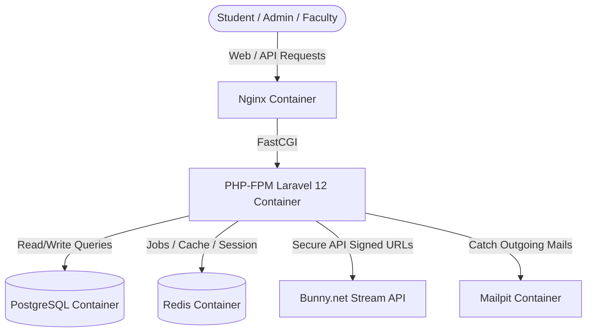
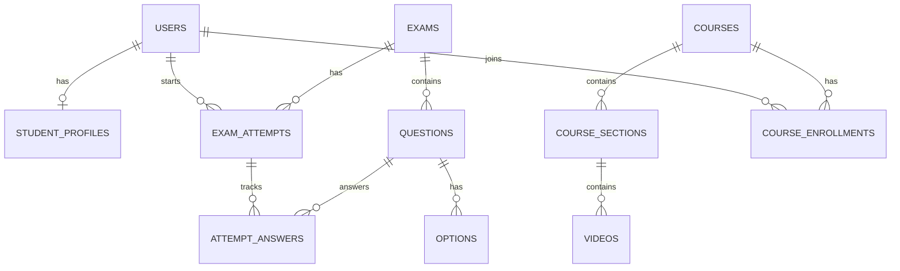

# THISAI IAS Academy - Developer & Architecture Guide

This document outlines the detailed system architecture, directory structures, data models, service patterns, and developer guidelines for the THISAI IAS Academy Platform.

---

## 🏛️ 1. Architecture Overview

THISAI is designed as a modular monolithic web application built on **Laravel 12** and **Filament 4**, containerized with **Docker**, and utilizing **PostgreSQL** (relational database) and **Redis** (caching and queues).



### Directory Structure & Layout
```
Thisai/
├── app/
│   ├── Enums/             # backed string enums (UserRole, ExamType, QuestionType, etc.)
│   ├── Filament/          # Filament 4 Admin and Faculty Resource panels
│   ├── Http/
│   │   ├── Controllers/   # Student web controllers & API endpoints
│   │   └── Middleware/    # Auth and Role check middlewares
│   ├── Models/            # Database Eloquent models & casts
│   └── Services/          # Dedicated domain business logic (Exam, Bunny, Leaderboard)
├── config/                # Platform configurations (thisai.php, bunny.php)
├── database/
│   ├── migrations/        # Complete database schema timeline
│   └── seeders/           # Core IAS subjects and demo datasets
├── docker/                # Nginx config & custom PHP-FPM Dockerfile
├── resources/
│   ├── css/               # TailwindCSS v4 theme tokens
│   ├── js/                # App entry scripts & AlpineJS controllers
│   └── views/             # Premium Blade student views, layout containers & components
├── routes/
│   ├── api.php            # AJAX endpoints (save answers, watched progress)
│   └── web.php            # Web routing container for students & controllers
└── tests/                 # Automated feature integration tests
```

---

## 🗄️ 2. Database Schema & Data Models

The system architecture utilizes **21 primary database tables** modeled with strict foreign key constraints:



### Core Models & Relationships

1. **User (`App\Models\User`)**:
   - Fields: `name`, `email`, `phone`, `role` (`UserRole` Enum), `is_active` (boolean).
   - Relations: `hasOne(StudentProfile)`, `hasMany(ExamAttempt)`, `belongsToMany(Course, course_enrollments)`.
2. **Exam (`App\Models\Exam`)**:
   - Fields: `title`, `slug`, `type` (`ExamType` Enum), `duration_minutes`, `total_marks`, `negative_marking`.
   - Relations: `hasMany(Question)`, `hasMany(ExamAttempt)`.
3. **Question & Option (`App\Models\Question`, `App\Models\Option`)**:
   - Questions can be `single_correct` or `multiple_correct`.
   - Options specify text and `is_correct` flags.
4. **ExamAttempt & AttemptAnswer (`App\Models\ExamAttempt`, `App\Models\AttemptAnswer`)**:
   - `ExamAttempt` tracks the session, duration, correct/wrong counts, total score, and percentile rank.
   - `AttemptAnswer` records `selected_option_ids` (stored as json), correctness, marks obtained, and duration spent.
5. **Course, Section & Video (`App\Models\Course`, `App\Models\CourseSection`, `App\Models\Video`)**:
   - Courses hold subject references and status indicators.
   - Videos hold references to the Bunny.net stream library and watch duration trackers.

---

## ⚙️ 3. Core Services & Domain Logic

Rather than placing logic in controllers or models, THISAI uses dedicated service containers located under `app/Services/`:

### A. Exam Engine (`ExamService.php` & `ScoreCalculator.php`)
- **`startExam()`**: Instantiates an `ExamAttempt` with a secure random session token and pre-creates blank `AttemptAnswer` records for all exam questions. This avoids querying database records during active test-taking.
- **`saveAnswer()`**: Increments time spent on the question, updates selected option IDs, and persists states asynchronously via AJAX.
- **`submitExam()`**: Calls the `ScoreCalculator` to cross-reference selected option IDs against actual correct answers (accounting for negative markings), updates student score aggregates, and recalculates the leaderboard percentiles.

### B. Secure Streaming (`BunnyStreamService.php` & `BunnySignedUrlService.php`)
- Integrates Bunny.net Video Delivery API.
- Generates a **SHA256 signed embed URL** using your token key (`BUNNY_TOKEN_KEY`) with a customizable expiration epoch. This prevents students from extracting direct video links or sharing raw streaming resources outside the platform.

### C. Leaderboards (`LeaderboardService.php`)
- Computes student performance analytics dynamically.
- Period snaps are divided into Daily, Weekly, Monthly, and Overall boards, which can be cached inside Redis to avoid heavy relational aggregates under peak load.

---

## 🛠️ 4. Local Development Workflows

Run the containerized application with these key commands:

### Running Container Lifecycle
```bash
# Start Nginx, PHP, Postgres, and Redis containers
docker compose up -d

# Stop and shut down all containers
docker compose down

# Check live logs for container issues
docker compose logs -f app
```

### DB Operations & Setup
```bash
# Refresh database and run seeds (Subjects, Categories, Admin account, Demo Courses)
docker compose exec app php artisan migrate:fresh --seed

# Access database directly
docker compose exec db psql -U postgres -d thisai
```

### Clearing Caches & Assets
```bash
# Clear compiled views (crucial when Blade changes are not reflecting)
docker compose exec app php artisan view:clear

# Clear configuration, routes, and main caches
docker compose exec app php artisan config:clear
docker compose exec app php artisan cache:clear
```

### Executing Automated Tests
All endpoints, score calculators, authentication scopes, and permission levels are verified via automated tests:
```bash
docker compose exec app php artisan test
```

---

## 📈 5. Production Optimization & Scaling Strategy

If deploying this application to handle **10,000+ simultaneous users**, implement these architecture adjustments:

### 1. Optimize Leaderboard Rank Calculation
The current `updatePercentilesAndRanks()` function calculates ranks inline on each submission:
```php
// app/Services/ExamService.php
foreach ($attempts as $index => $attempt) {
    $attempt->rank = $index + 1;
    $attempt->save(); // O(N) database writes inside loop on submit
}
```
* **Bottleneck**: This creates an $O(N^2)$ write problem when thousands of users submit at once.
* **Scale Solution**: Remove this loop. Calculate percentiles and ranks dynamically inside views using PostgreSQL window functions:
  ```sql
  SELECT *, RANK() OVER (PARTITION BY exam_id ORDER BY score DESC) as rank FROM exam_attempts;
  ```

### 2. Batch Attempt Answer Initialization
On starting an exam, the service writes answers sequentially:
```php
foreach ($questions as $question) {
    AttemptAnswer::create([...]); // Sequential database inserts
}
```
* **Scale Solution**: Rewrite this to compile a single array and execute a database bulk insert:
  ```php
  AttemptAnswer::insert($insertData);
  ```

### 3. Redis-backed Sessions
Switch Laravel session drivers from database/cookie to Redis in production:
```env
SESSION_DRIVER=redis
QUEUE_CONNECTION=redis
```
This offloads the write load from PostgreSQL and allows handling high volumes of requests seamlessly.
